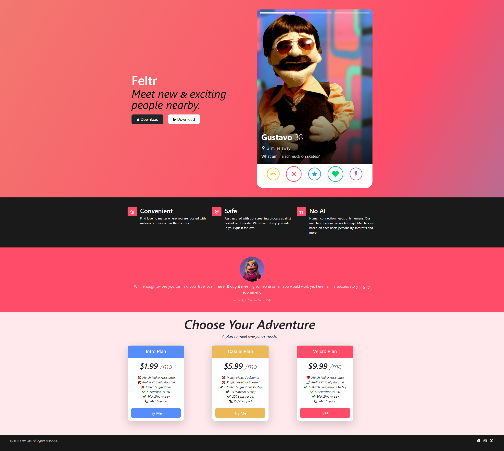
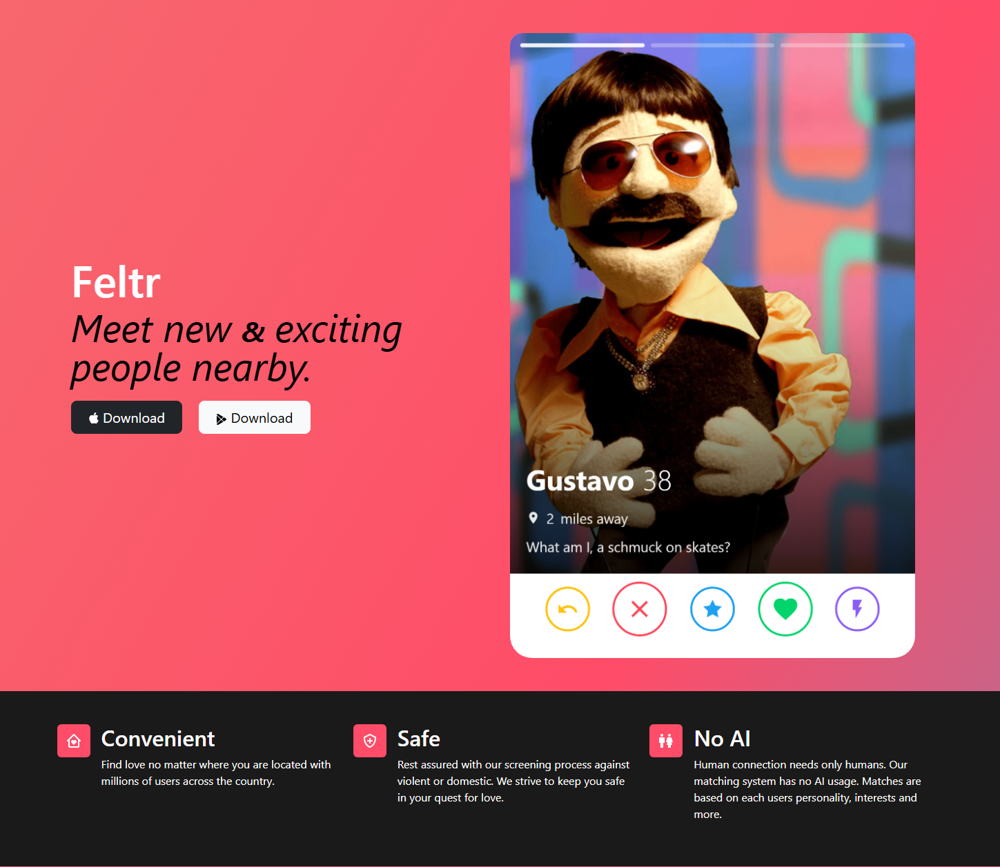
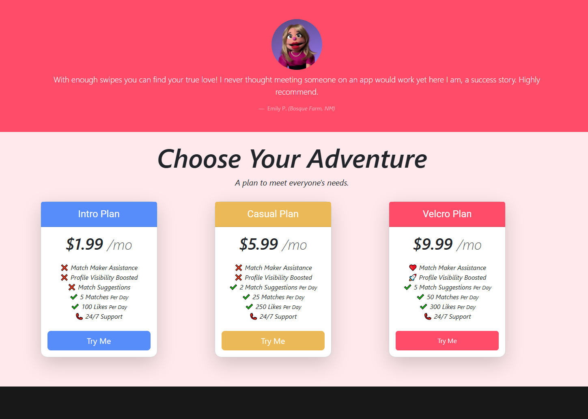

# Feltr - Dating App Site (Template)

## 📝 Description

Feltr - Dating App Site is a template created from a project while studying Full Stack Development by Dr. Angela Yu. This is my take on the "11.3 TinDog Project" from her course. Feel free to use the template.

## ⚡ Quick Start

```bash

# Clone the repository
git clone https://github.com/BowieParadox/Feltr-Dating-App-TEMPLATE.git

# Install dependencies and run

# (See Development Setup below)
```

## 📸 Screenshots







## 📁 Project Structure

```
Feltr-Dating-App-TEMPLATE
├── css
│   └── style.css
├── images
│   ├── muppet-profile.png
│   └── muppet-review.jpg
├── docs
│   ├── Website-Page-Screenshot-FullView.png
│   ├── Website-Page-Screenshot-TopHalf.png
│   └── Website-Page-Screenshot-BottomHalf.png
└── index.html
```
